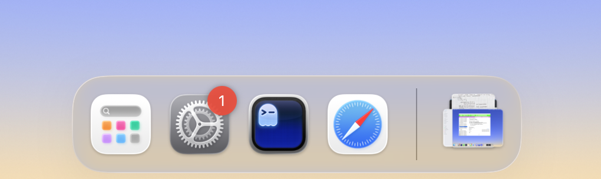

  

# Hider

Hider tweak hides Finder and Trash icons out of the box. Uses Ammonia Injector.

## Installation

1. Clone this repository
2. run `make install`
3. to uninstall, you could use `make uninstall`. 

The end..

Must partially disable SIP. You know, the "usual". 

## Credits

-   Alex Spaulding (@aspauldingcode)

## License

This project is licensed under the [MIT License](LICENSE).

## Support

- [GitHub Sponsors](https://github.com/sponsors/aspauldingcode)
- [Ko-fi](https://ko-fi.com/aspauldingcode)
